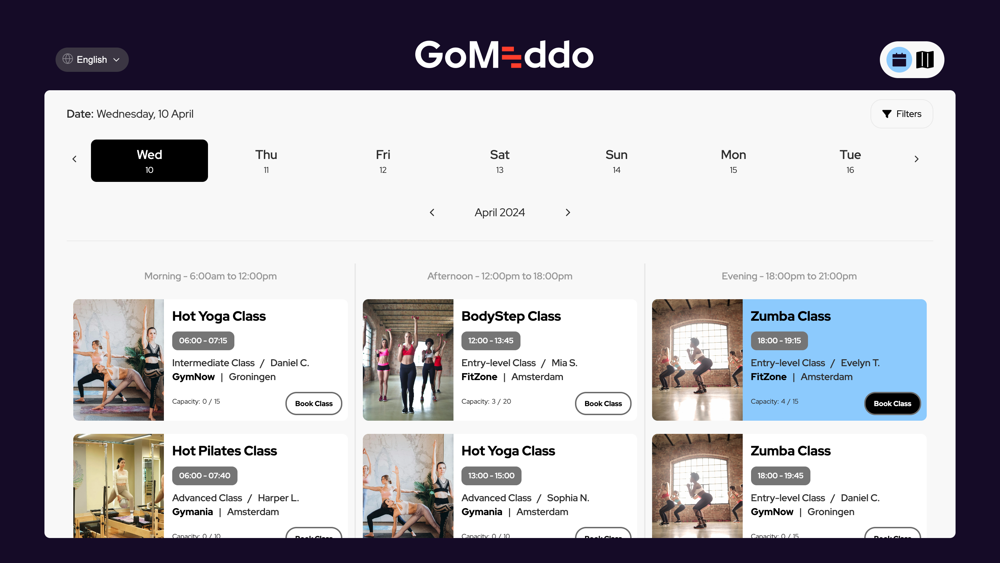

<h1 align="center">Book an Activity</h1>

  

# Get started with the GoMeddo JS SDK

This project uses the [GoMeddo JS SDK](https://github.com/gomeddo/js-sdk) to implement an application that lets a user register for a gym class via [GoMeddo](https://gomeddo.com).

## Demo

You can find a demo [here](https://gomeddo-activity-scheduling-and-registration.vercel.app/home).

## High-Level Use Case

This example provides a starting point for integrating _GoMeddo's_ "**Activity Registration**" capabilities into your website using the Javascript SDK.

An activity has a certain **Capacity**, a **Staff Member** and a **Location**. Your customers can sign up for this activity.

The example demonstrates this by allowing customers to book a gym class, while focused on gym class bookings it demonstrates the process and structure needed for a range of activity booking scenarios.

## Overview of User Interaction on the Frontend

The dashboard of the application lists various activities available which is filtered based on dates and time. Users can additionally filter the activities using the filter option provided on the UI. Once a user selects an activity from available activities the 'Book' button will be visible on the UI if the capacity of the activity is not full. Users will be then prompted to input the contact information and make their reservation for the selected activity.

# Step-by-Step Guide to Setting Up The Example

1. **Set Up Resources and Resource Types**:

   - Define the hierarchical structure for your resources:
     - **Organization** > **Country** > **City** > **Fitness Centre** > **Rooms**.
   - Example:
     - **Organization**: Your Organization
     - **Country**: Netherlands
     - **City**: Amsterdam
     - **Fitness Centre**: FitZone
     - **Room**: Entry Level Room
   - Note: There can be multiple Resources of the type "Room", "City" and "Fitness Center".

2. **Create Reservation Types**:

   - Define a Reservation Type for each class type (e.g., Pilates, Yoga).
   - Create a custom image field for each class type and add an image representing the class.

3. **Create Custom Fields Under the Reservation Object**:

   - Add the following custom fields to provide detailed information about each activity:

     - `Staff_Name__c` (Formula Text Field)
     - `Room_Name__c` (Formula Text Field)
     - `Room_Capacity__c` (Formula Number Field)
     - `City_Location__c` (Formula Text Field)
     - `Center_Name__c` (Formula ext Field)
     - `reservation_type_image__c` (Custom Image Field)

4. **Create Staff Members**:

   - Add Staff Members (instructors) who will be associated with the reservations.

5. **Create Reservations**:
   - Create Reservations for the classes you want to display on the frontend.
   - Ensure each Reservation is linked to the appropriate Reservation Types, Staff, and other Custom Fields.

Note:

- Ensure that each resource in GoMeddo is marked as '**_isActive_**' and '**_Api Visible_**' to be displayed and available through the API.
- Ensure that **Resources**, **Resources Types**, **Staff** and **Reservation Types** are set up in _GoMeddo_. For the booking system to accurately display available gym classes, each class must be created as a reservation within _GoMeddo_. This step is vital as the SDK relies on these existing **Reservations** to present customers with real-time availability and booking options.

## API Key Requirement

To access to the SDK’s functionalities, an API key from _GoMeddo_ is required. For instructions on obtaining this key refer to [First time Set-up](https://gomeddo.atlassian.net/wiki/spaces/WID/pages/3353837569/First+time+Set-up). Remember to **whitelist** your domain as a part of the setup process and grant **privileged** access to the API key.

### UI Setup

The UI is built as a React website which can be accessed by users to make reservations. The code is organized as a standard react application which communicates with the GoMeddo to make reservations.

Perform the following steps to run the project in a local environment.

- Clone the code to a local repository
- Install necessary dependencies and packages by running `npm install`
- Start the local dev server using the command `npm run start`

#### Link to Github and Wiki

For further information on utilizing the GoMeddo Javascript SDK, visit [GoMeddo JS SDK wiki](https://github.com/GoMeddo/js-sdk/wiki).

#### Similar use cases

- Have your students sign up for sports activities
- Have your patients sign up for group sessions
- Have your student sign up for coding bootcamps.
- Have your educators enrolled in professional development seminars.
- Have your healthcare professionals enrolled in continuing education courses.
- Have your students volunteer for peer mentoring programs.
